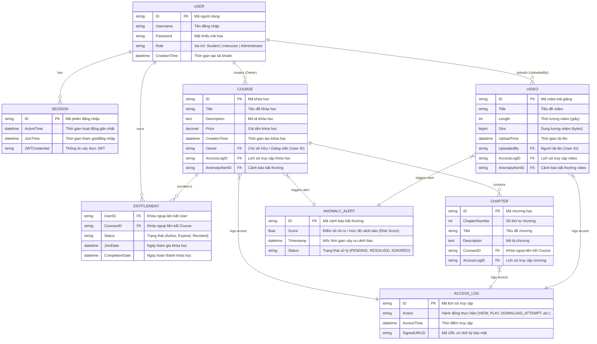

# SecureLearn - Database Schema Specification (Cơ sở dữ liệu Hệ thống SecureLearn)

Tài liệu thiết kế cấu trúc Cơ sở dữ liệu cho hệ thống **SecureLearn** (Quản lý và Bảo mật Video Bài giảng trực tuyến).

---

## 📊 1. Sơ đồ thực thể liên kết (Mermaid ER Diagram)

---

## 📋 2. Chi tiết các Bảng và Trường Dữ Liệu

### 1. User (Người dùng)
- **ID** (`PK`): Khóa chính nhận diện người dùng.
- **Username**: Tên đăng nhập hệ thống.
- **Password**: Mật khẩu mã hóa (Hash).
- **Role**: Vai trò trong hệ thống (ví dụ: `Student`, `Instructor`, `Administrator`).
- **CreationTime**: Mốc thời gian tạo tài khoản.

### 2. Session (Phiên đăng nhập)
- **ID** (`PK`): Mã phiên đăng nhập.
- **ActiveTime**: Thời gian hoạt động cuối cùng của phiên.
- **JoinTime**: Thời gian khởi tạo/đăng nhập.
- **JWT credential**: Chuỗi token xác thực JWT (JSON Web Token).

### 3. Entitlement (Bảng trung gian phân quyền & quyền sở hữu khóa học)
- **UserID** (`FK` -> `User.ID`): ID học viên sở hữu quyền truy cập.
- **CoursesID** (`FK` -> `Course.ID`): ID khóa học được phân quyền.
- **Status**: Trạng thái quyền truy cập (`Active`, `Expired`, `Revoked`).
- **Join Date**: Ngày học viên bắt đầu tham gia khóa học.
- **Completion Date**: Ngày học viên hoàn thành khóa học.

### 4. Course (Khóa học)
- **ID** (`PK`): Mã định danh khóa học.
- **Title**: Tiêu đề khóa học.
- **Description**: Mô tả chi tiết nội dung khóa học.
- **Price**: Học phí khóa học.
- **Creation Time**: Mốc thời gian khởi tạo khóa học.
- **Owner** (`FK` -> `User.ID`): Mã giảng viên/chủ sở hữu tạo khóa học.
- **AccessLogID** (`FK` -> `AccessLog.ID`): Mã liên kết nhật ký truy cập khóa học.
- **AnomalyAlertID** (`FK` -> `AnomalyAlert.ID`): Mã liên kết cảnh báo rò rỉ/bất thường.

### 5. Chapter (Chương học)
- **ID** (`PK`): Mã định danh chương học.
- **ChapterNumber**: Số thứ tự chương trong khóa học (`1, 2, 3...`).
- **Title**: Tiêu đề chương.
- **Description**: Mô tả chi tiết nội dung chương.
- **CoursesID** (`FK` -> `Course.ID`): Khóa học thuộc về.
- **AccessLogID** (`FK` -> `AccessLog.ID`): Mã nhật ký truy cập chương học.

### 6. Video (Video bài giảng)
- **ID** (`PK`): Mã bài giảng video.
- **Title**: Tiêu đề bài giảng video.
- **Length**: Thời lượng video (đơn vị: giây hoặc mm:ss).
- **Size**: Dung lượng tập tin video (bytes/MB).
- **UploadTime**: Mốc thời gian tải video lên hệ thống.
- **UploadedBy** (`FK` -> `User.ID`): Mã giảng viên tải video lên.
- **AccessLogID** (`FK` -> `AccessLog.ID`): Mã nhật ký phát/truy cập video.
- **AnomalyAlertID** (`FK` -> `AnomalyAlert.ID`): Mã phát hiện rò rỉ / cảnh báo xem bất thường.

### 7. AccessLog (Lịch sử truy cập & Bảo mật)
- **ID** (`PK`): Mã bản ghi nhật ký.
- **Action**: Hành động người dùng (ví dụ: `REQUEST_SIGNED_URL`, `PLAY_SEGMENT`, `DOWNLOAD_ATTEMPT`).
- **Access Time**: Mốc thời gian thực hiện truy cập.
- **SignedURLID**: Mã token URL có chữ ký bảo mật được cấp cho phiên làm việc.

### 8. AnomalyAlert (Cảnh báo bất thường / Phát hiện rò rỉ DRM)
- **ID** (`PK`): Mã bản ghi cảnh báo.
- **Score**: Điểm số mức độ rủi ro (Risk Score từ 0.0 đến 1.0 hoặc 0 đến 100).
- **Timestamp**: Thời điểm hệ thống ghi nhận phát hiện bất thường.
- **Status**: Trạng thái xử lý cảnh báo (ví dụ: `OPEN`, `UNDER_REVIEW`, `MITIGATED`, `CLOSED`).
